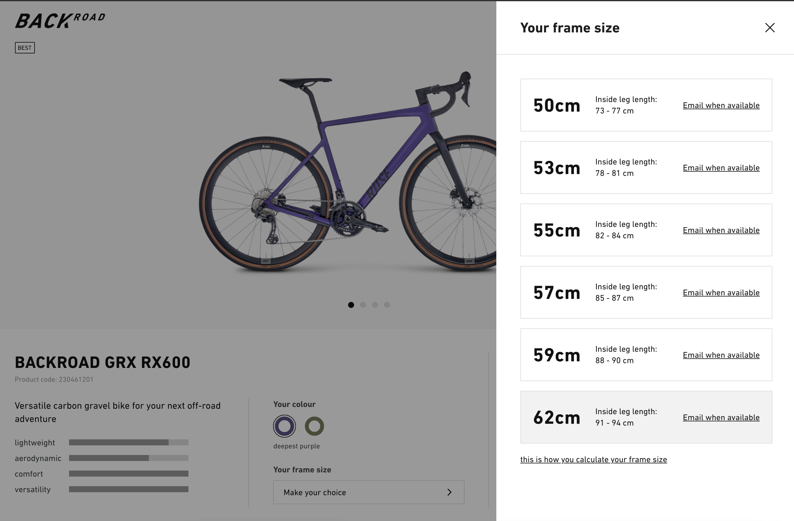

# 🚲 Rose bikes stock availability checker 

Rosebikes stock availability checker tool. To get notified from stock availability and price changes. I hope this tool helps you to get an rose bike as fast as possible.

It started from a personal weekend project to get an rosebike before the sommer of 2021 ends :). 

> **_NOTE:_**  It`s and quick and dirty weekend project, which just works. There is a lot of ugly hardcoded stuff.

 

## 💡 Introduction

This project was born out of necessity. For two years I would like to finally buy a good bike. However, due to little time and different projects I have always postponed this. 
Through the current COVID-19 situation has then arisen the urge to have to quickly buy a bike.
For me it was clear that it must be a Rosebike. 
The problem, however, is that the Rosebike bikes, especially the Gravel bike types, are very difficult to get without having to take long delivery times.

### Why I did not use the notification function on the website

On the website there is also an notification registration button.
So you can register an account and get notified if the bike is available again.

> **_RESULT:_**  The button notification never worked for me. And believe me, I visited the site several times a day and checked the availability of the bike.

### Stock availability observations

During the many visits I have observed that the delivery time specifications have changed several times. For example, sometimes a bike was available in 3 weeks and other times not for another 26 weeks. This led to the idea for this project. 

 

## ⚙️ Functionality 

