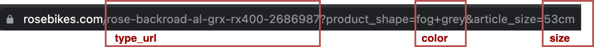

# 🚲 Rose bikes stock availability checker 

Rosebikes stock availability checker tool is a small application which runs completly on github actions to get notified of stock availability and price changes. 

It started from a personal weekend project to get a rosebike before the summer of 2021 ends :). 

> **_NOTE:_**  It`s a quick and dirty weekend project, which just works. There is a lot of ugly hardcoded stuff. So feel free to improve it and contribute to it.


## **💡 Background story**

This project was born out of necessity. For two years I would like to finally buy a good bike. However, due to little time and different projects I have always postponed this. 
Through the current COVID-19 situation has then arisen the urge to have to quickly buy a bike.
As for me, it was clear that it must be a Rosebike. 
The problem, however, is that the Rosebike bikes, especially the Gravel bike types, are very difficult to get without having to take long delivery times.

### Why I did not use the notification function on the website

On the website, there is also a notification registration button.
So you can register an account and get notified if the bike is available again.


> **_RESULT:_**  The notification never worked for me. And believe me, I visited the site several times a day and checked the availability of the bike.


### Stock availability observations

During the many visits, I have observed that the delivery time specifications have changed several times. For example, sometimes a bike was available in 3 weeks and other times not for another 26 weeks. This led to the idea for this project. 

The program checks the availability of the selected bikes at a specified interval. It checks if there is a change in the delivery time or availability, as well as the price. If there is a change, a report is generated, which contains the changes. The report is then sent via mail.


## ⚙️ **Usage**

The `rosebikes-stock-availability` checker tool can be configured for your personal usage.
Just fork the project and run it on Github Action runners.

**_1. Define the desired bikes_**

Add the bikes you want to observe to the `bike_types.json` file.

```
    {
        "type_url": "rose-backroad-al-grx-rx400-2686987",
        "color": "fog+grey",
        "size": "57cm"
    }
```
Just navigate to the sites and extract the URL as shown in the image.



**_2. Set up report notifications_**

Github Actions is used to execute the tool and also to send notifications.

```yml
# ...
 - name: Send email
        if: steps.bikes_changes_available.outputs.files_exists == 'true'
        uses: dawidd6/action-send-mail@v3.1.0
        with:
          server_address: smtp.gmail.com
          server_port: 465
          username: ${{secrets.MAIL_USERNAME}}
          password: ${{secrets.MAIL_PASSWORD}}
          subject: ROSEBIKES - Change
          from: ${{secrets.MAIL_USERNAME}}
          to: ${{secrets.MAIL_USERNAME}}
          secure: true
          html_body: file://report/merged_report.html
# ...
```

I personaly use gmail to send and receive the email notifications. I strongly recommend to use app passwords instead of your master password!

https://support.google.com/accounts/answer/185833?p=app_passwords_sa&hl=en

> **_ATTENTION:_**  Use Github Secrets for sensitive information like username, and password!
> 

### **Optional configurations**

**_Check interval time_**

The check is executed every hour. It can be changed, by modifing the cron execution configuration.

```yml
# ...
on:
  schedule:
  - cron: "0 0-23 * * *"
# ...
```

> **_NOTE:_** Please do not use too short time request cycles to keep the server requests as low as possible. 
> Be aware that the execution time will reduce your free Github Action Runner minutes if you use public runner instances. Check the following link for more information: https://docs.github.com/en/billing/managing-billing-for-github-actions/about-billing-for-github-actions


> **_NOTE:_** I only used the german website for the `rosebikes-stock-availability` tool. If you want it to use for the international site just, change the variable `mainurl` from `mainurl = "https://www.rosebikes.de"` to `mainurl = "https://www.rosebikes.com"`.